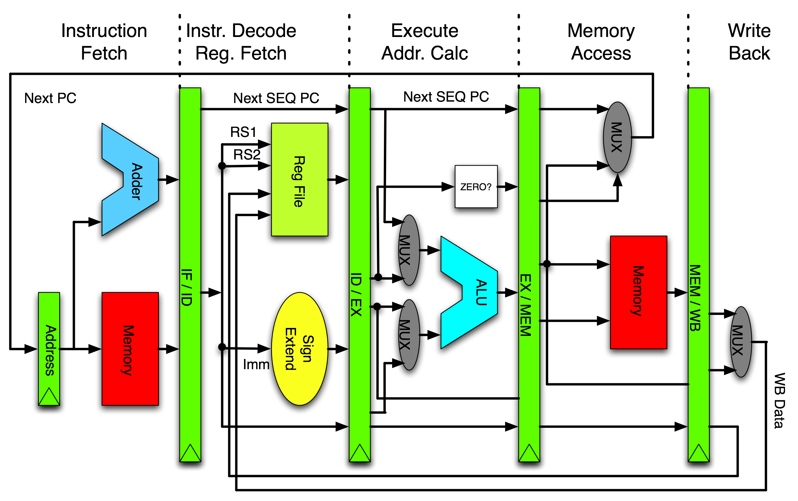

# MIPS-Pipelined
The main **5-Stages** in a RISC pipeline architecture 
 - Instruction Fetch
 - Instruction Decode
 - Execute
 - Memory Access
 - Writeback
 


### Data Memory

**INPUT:**
- Address: What address in memory you will look up Read/Write.
- Write data: the data that will get written into memory

**OUTPUT:**
- Read Data: data read for a specific address

**CONTROL INPUTS:**
 - MemWrite: take the write data and write it on correct address specified by address input. 
 - MemRead: Look at address, and transfer the data onto read data.

```VHDL 
entity datamemory1 is
    Port ( address : in STD_LOGIC_VECTOR (31 downto 0);
           WriteData : in STD_LOGIC_VECTOR (31 downto 0);
           ReadData : out STD_LOGIC_VECTOR (31 downto 0);
           MemRead : in STD_LOGIC;
           MemWrite : in STD_LOGIC ;
          clk : in STD_LOGIC
           );
          
end datamemory1;
```

 ```VHDL
  begin
 datamem:
 process(MemRead,MemWrite)
 variable mem_adr: natural;
 
begin
ReadData <= mydata((to_integer(unsigned(address))-268435456)/4);
if(MemWrite='1') then
mydata((to_integer(unsigned(address))-268435456)/4) <= WriteData;
end if;
```

### Control Unit

**INPUT:**
- OpCode: 26th to 31st bit of the instructions. 


**OUTPUT:**
-  Branch: 	1 bit
-  MemRead: 	1 bit
-  MemWrite: 	1 bit
-  MemToReg: 	1 bits
-  RegDst: 	1 bit
-  ALUOp: 	2 bits
-  ALUsrc: 	1 bit
-  Jump: 		1 bit


